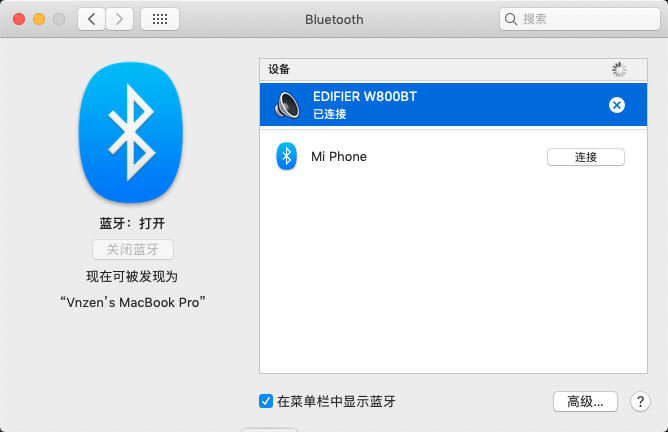

# Hackintosh Hasee k680e-g6d1 i5-7400
我使用的 MacOS 是[【黑果小兵】macOS Mojave 10.14.6 18G87 正式版 with Clover 5050原版镜像\[双EFI双平台终极版\]](https://blog.daliansky.net/macOS-Mojave-10.14.6-18G87-Release-version-with-Clover-5033-original-image.html)  
这CLOVER是东瓶西凑出来的，我有什问题我也解决不了
## 配置
|  K680E-G6D1   |    配置     |      工作与否    |
|  :---------:  | :--------: |  :-----------:  | 
|     CPU       |    i5-7400 |          Y      |
|     核显       |  Intel HD 630 |        Y     |
|     独显       |  NVIDIA 1050Ti  |      N     |
|     声卡       |              |        Y      |
|    麦克风       |              |  some time Y  |
|    USB3.0      |              |       Y      |
|    USB2.0      |               |      Y      |
|     摄像头      |               |      Y      |
|     有线网卡    |  Realtek 8411B  |      Y      |
|     Wi-Fi      |   Intel 3165  |      N       |
|     蓝牙        |               |   some time Y |
|   亮度调节      |                |      N       |
|   睡眠         |                |      Y       |
|    电池        |                |      Y        |
|    自带键盘     |                |  window键与Alt键互换 | 
|    触摸板      |                |  部分三指手势可用  | 

## 截图

# 食用步骤  
1. 制作U盘  
    - [参考](https://blog.daliansky.net/MacOS-installation-tutorial-XiaoMi-Pro-installation-process-records.html)  
2. 安装第一阶段  
    - 注意不用改U盘的任何东西  
    - [同样参考](https://blog.daliansky.net/MacOS-installation-tutorial-XiaoMi-Pro-installation-process-records.html)  
3. 安装第二阶段  
    - [同样参考](https://blog.daliansky.net/MacOS-installation-tutorial-XiaoMi-Pro-installation-process-records.html)  
    - 注意 第二阶段会重启两次  
        - 第一次在进度条还没动一半的时候，会变成跑代码，出现 kill all 什么的，然后重启‘  
        - 第二次 进度条基本跑完，会重启，重启后无法进入系统，出现 please go to ...http....   
    - 接下来就可以替换CLOVER了  
4. 替换U盘的CLOVER文件夹  
    - 下载 [CLOVER.ZIP](https://github.com/Vnzen/Hackintosh_hasee_k680e-g6d1_clover/releases)  
        - 备份原来的CLOVER
        - 删掉原来并替换  
        - 或者直接覆盖  
5. 重启进入系统  
    - 若不能进系统，请恢复备份，并且把CLOVER/config-Other/config_HD615_620_630_640_650.plist更名为并覆盖原来的CLOVER/config.plist即可以进入系统了  
    - 自己按需求修改  
    - Enjoy yourself  
# 重要的参考资料  
感谢黑果小兵的[【黑果小兵】macOS Mojave 10.14.6 18G87 正式版 with Clover 5050原版镜像\[双EFI双平台终极版\]](https://blog.daliansky.net/macOS-Mojave-10.14.6-18G87-Release-version-with-Clover-5033-original-image.html)  
感谢[爅璃博客](https://www.jianshu.com/u/beb5cf42a058)的详细博客[MAC 10.14 安装教程4-制作安装EFI文件](https://www.jianshu.com/p/2ad57fca5969)  
感谢[爅璃博客](https://www.jianshu.com/u/beb5cf42a058)的详细博客[MAC 10.14 安装教程10-基于黑果小兵大神EFI文件的修改过程](https://www.jianshu.com/p/81e329c50120)   
感谢老哥的[K680E(W650KK)安装macOS high sierra](http://luox.pro/2018/05/18/K680E(W650KK)%E5%AE%89%E8%A3%85macOS%20high%20sierra/)模版参考  
感谢[cewnhai/macOS-for-W650KJ-KK]的模版参考  
